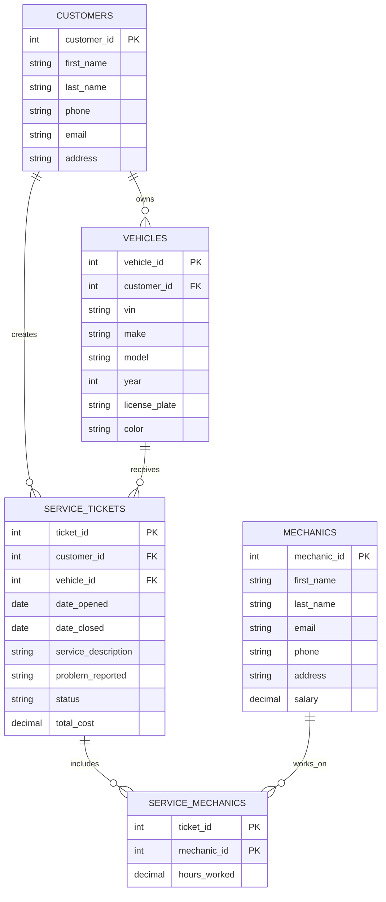

# Mechanic Shop ERD

## ERD Diagram

## Relationships
- One customer can own many vehicles.
- One customer can have many service tickets.
- One vehicle can have many service tickets.
- One service ticket belongs to one customer.
- One service ticket belongs to one vehicle.
- One service ticket can involve many mechanics.
- One mechanic can work on many service tickets.
